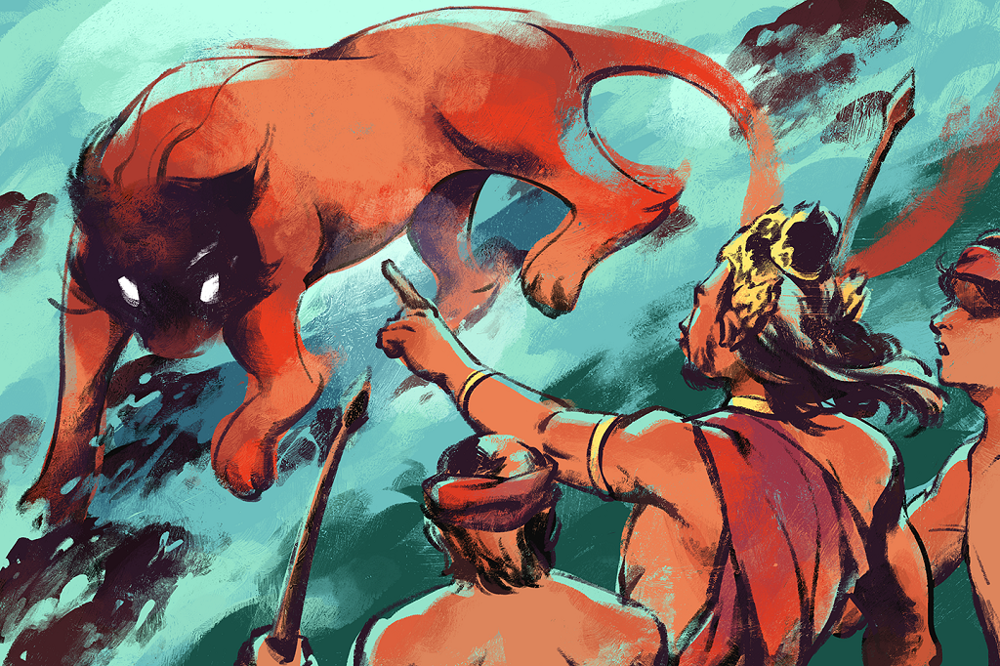
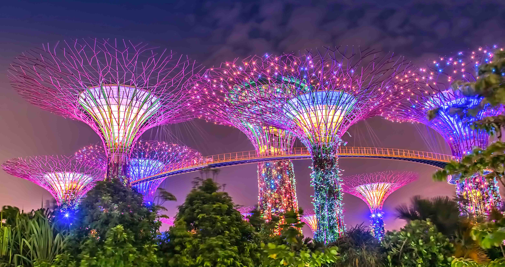

GitHub link
Repository:
https://github.com/qel15/CS4127-A1-PENGI52505.git 
Website:
https://qel15.github.io/CS4127-A1-PENGI52505/
Development Log
Date: 1-11-2024 
Home page
•	Added index.html for main homepage layout.
•	Added style.css for website styling, responsive layout, basic design elements and navbar hover effects.
•	Included Script.js for future interactivity.
•	Added header for background.
•	Added navigation links to other pages and logo.
•	Styled buttons and links for navigation and user engagement.
History Page
•	Added History Page.html for history page.
•	Added history.css for styling, responsive layout, background, basic design elements and navbar hover effects.
•	Added header for navigation links to other pages and logo.
•	Included Script.js for future interactivity.
•	Added div for background. 
•	Added images and content sections, alt text and semantic HTML5 tags.
•	Added historical content into three sections: Origins, Expulsion, and Development, with related images and text.
•	Added styled buttons with hover animations that leads to a youtube video.
Culture Page
Date: 2-11-2024 
•	Added Culture Page.html for culture page layout.
•	Added Pages_Styles.css for website styling, responsive layout, basic design elements and navbar hover effects.
•	Included Script.js for future interactivity.
•	Added header for navigation links to other pages and logo.
•	Added the "Introduction to Singaporean Culture" section, with text content and formatting. 
•	Created styling for headings and paragraphs for better readability.
•	Added images to make it more engaging.
•	Added the “Customs and Traditions” section. 
•	Added text content.
•	Added images of shaking hands and taking shoes off
•	Designed appropriate styling to images and text.
•	Finished the "Languages" section, mentioning the four official languages of Singapore.
•	Added an image showing Singlish and styled it.
•	Added the “Architecture” section. 
•	Added images of Marina Bay Sands and Gardens by the bay
•	Added text content detailing the architecture of Singapore.
•	Designed appropriate styling.
•	Added the “Religion” section. 
•	Finished the "Religion" section to discuss religious diversity in Singapore.
•	Added an image of Religious diversity.
•	Designed proper styling.
Date: 3-11-2024
•	Added div for background.
Activities page
Date: 8-11-2024
•	Added Activities Page.html for culture page layout.
•	Linked Pages_Styles.css for website styling, responsive layout, basic design elements and navbar hover effects.
•	Included Script.js for future interactivity.
•	Added header for navigation links to other pages and logo.
•	Added the "Activities to do in Singapore" heading and an introductory paragraph.
•	Styled the introductory section to keep visual consistency with other pages.
•	Completed the Gardens by the Bay section.
•	Added text content and historical facts in bullet points.
•	Added images and social media links for their Instagram, YouTube, and Twitter with the respective icons.
•	Added hover effects for the social media icons.
•	Added the “Universal Studios Singapore” section detailing what its like to be there and showing how the park is separated into 6 themes.
•	Experimented with Javascript and added a function that will display the zones names when hovering cursor over the image.
•	Completed the “Marina Bay Sands” section
•	Added an image for better engagement and visualization.
•	Included a descriptive paragraph about its importance.
Date: 9-11-2024
•	Completed the “Singapore Zoo” section
•	Included an introduction to the zoo and its open air habitats.
•	Included a gallery of animal images with captions.
•	Styled the animal images for consistent alignment and spacing.
Contact page 
Date: 11-11-2024
•	Added the Contact Page.html.
•	Added contact.css for website styling, responsive layout, basic design elements and navbar hover effects.
•	Included Script.js for interactivity.
•	Added a background image.
•	Created error message where when a field is invalid, it shows an error message.
•	Designed a submit button with a hover effect.
•	Experimented more with JavaScript.
•	Created a function named validateField to check if the input field is empty. If so, an error message appears.
•	Added another function to each input field to validate in real-time as the user types.
•	Created a form validation function named validateForm that checks the form before submitting. It prevents form submission if the fields are invalid.
Date: 21-11-2024
•	Fixed errors and warnings such as unnecessary Line Breaks ( ):
o	Error: Use of   instead of  .
o	Fix: Replaced   with   to adhere to proper HTML standards.
•	Fixed missing Heading error in <section> Elements
o	Error: <section> elements without headings triggered warnings.
o	Fix: Replaced <section> elements with 
 elements in areas where headings were unnecessary.
•	Bad use of 
 Element
o	Error: The 
 element was used as a child of <h1> and <h2> elements, which was invalid.
o	Fix: Removed the 
 element and center aligned the headings using CSS.
•	Bad use of 
 Element
o	Error: Same issue as in the Culture Page.
o	Fix: Removed the 
 element and center aligned the headings using CSS.

•	Fixed unnecessary Line Break
o	Error: An accidental   was included in the HTM	L.
o	Fix: Removed the unnecessary   to clean up the code.
Wireframe
 
Bugs and errors
Home Page
  
History Page
 
Culture Page
 

Activities Page
 
Contact Page
 
style.css 
 
history.css
 
Pages_Style.css
 
contact.css
 
Report
I made this website with the knowledge gained from my lecturer and her slides and additional online resources primarily https://w3schools.com/ which helped a lot with CSS and JavaScript. As a beginner in JavaScript, my implementations on the contact and activities pages were experimental but turned out great. This website consists of 5 pages, the home, history, culture, activities and contact page. After completion, I checked for any warnings and errors and finding several as expected.
In the home page I designed a navigation bar which appears on every page, with Singapore’s flag on the top left, and navigation buttons on the top right. In the center, I placed the main topic “Singapore” using the <h1> element and center aligning it using CSS. I added a paragraph below it using the 
 tag and   tags to make it look better. Both were center aligned under the same class attribute <section class= “content”.  When making the buttons below the heading and paragraph, I used <button> elements as a descendant of the <a> element which triggered validation errors. This problem also happened in the history page I made where I linked it to the viral video of Lee Kwan Yew’s emotional breakdown after Singapore got expelled from Malaysia. When I tried to fix the errors, it disrupted the hover effects on the buttons or caused it to be left aligned, so the error remained unresolved. 

The history page I made about Singapore’s past was divided into three sections, the origins, expulsion and development where I talked about where Singapore originated, how it was expelled from Malaysia and how it redeveloped itself into the amazing wealthy country it is today. I added information, images, semantic HTML5 tags to structure it. I also added borders around the text and images for better visuals and engagement. An error related to the <section> elements where it required headings to be identified so I replaced it with  
 element and that fixed the problem. I also had experimented with some other semantic tags like <article> and <figure> which worked out well with my website and still looked like how I intended it to look.

The culture page I made explored the rich diversity and traditions of Singapore where I separated it into 4 sections. Each section had its own engaging images and text. The page starts off with an introduction talking about how Singaporean culture is greatly influenced by different cultures around the world. I used similar elements I had used in the history page like <section>, 
, <header> and others I decorated the website with CSS by arranging the text and images, adding colors, borders, increasing and decreasing the sizes of the texts and images and more. Errors occurred where I had improperly used the 
 tag as a child of <h1> and <h2> which I fixed by just center aligning it using CSS. A similar problem happened in the activities page. 

The activities page showed popular tourist attractions in Singapore such as Gardens by the Bay, Universal Studios, Marina Bay Sands and Singapore Zoo. I decorated this page in a very similar way I did the culture page. As for the Universal Studios section, I had experimented with JavaScript and placed images where if you hover your mouse over them, the names of the themes of the respected image will appear. I also added social media links with hover effects in the Gardens by the Bay section which leads to the place’s respected social media accounts. The errors I mentioned previously had also been fixed in the same way which was by removing the 
 tags and using CSS to center align the text.

The contact page was made focusing on user interaction using a form with real time validation using JavaScript. I used functions like validateField and validateForm which would display an error message when the information typed was invalid and ensure that the form would be fully validated before it was submitted. I then designed and decorated the page using CSS like the hover effects on the submit button. A minor error occurred where there was an unnecessary   tag was added accidentally so I removed it and no errors were found then. 

Despite the challenges, the unresolved <button> issue in particular, I was proud with what I made in the website as it did what I intended it to do. Each page reflects my web development skills as it is not just an application of what I learned but also a great opportunity for me to experiment with new material like what happened with JavaScript. 
Code
<!DOCTYPE html>
<html lang="en">
<head>
    <meta charset="UTF-8">
    <meta name="viewport" content="width=device-width, initial-scale=1">
    
    <link rel="stylesheet" type="text/css" href="style.css">
     <title>Singapore</title>
</head>
<body>
    <!-- Background section with background and main navigation -->
    <header class="banner">
        <!-- Kwik, C. (2023). Transforming Singapore towards sustainable tourism and urban living. [online] Open Access Government. Available at: https://www.openaccessgovernment.org/wp-content/uploads/2023/04/iStock-1173371572-scaled.jpg. [Accessed: 1 November 2024]-->

        <!-- Navigation bar -->
        <nav class="navbar">
            
            <!--Smith, W. 2024. Flag of Singapore. Encyclopaedia Britannica. [image] Available at: https://cdn.britannica.com/36/4036-050-37052A78/Flag-Singapore.jpg [Accessed: 1 November 2024]-->
            <ul>
                <!-- Navigation links -->
                <li><a href="index.html">Home</a> </li>
                <li><a href="history-page.html">History</a></li>
                <li><a href="culture-page.html">Culture</a></li>
                <li><a href="activities-page.html">Activities</a></li>
            </ul>
        </nav>

        <!-- Content section for main text and buttons -->
        <section class="content">
            <h1>Singapore</h1>
            

                Singapore, officially the Republic of Singapore, is an island country and city-state located in Southeast Asia.
                 Singapore is a sunny, tropical island in Southeast Asia, off the southern tip of the Malay Peninsula.  The
                country is 710 square kilometres and consists of five million people
                  For more information, you can visit their wiki <a href="https://en.wikipedia.org/wiki/Singapore" target="_blank" class="link-color">here</a>.
                <!--Ministry of Foreign Affairs Singapore. 2024. About Singapore. Singapore Ministry of Foreign Affairs. Available at: https://www.mfa.gov.sg/Overseas-Mission/Washington/About-Singapore#:~:text=Singapore%20is%20a%20sunny%2C%20tropical,%2C%20Malay%2C%20Indian%20and%20Eurasian [Accessed: 1 November 2024]-->
            

            <!-- Buttons linking to external video and internal contact page -->
            

                <a href="https://www.youtube.com/watch?v=kij3n1iikKc" target="_blank">
                    <button class="button" type="button">Trailer of Singapore</button>
                </a>
                <a href="contact.html" target="_self">
                    <button class="button" type="button">Contact us!</button>
                </a>
            

        </section>
    </header>
</body>
</html>
* {
    margin: 0;
    padding: 0;
    font-family: sans-serif;
}

/* Background Styling */
.banner {
    width: 100%;
    height: 100vh;
    background-image: linear-gradient(rgba(0, 0, 0, 0.75), rgba(0, 0, 0, 0.75)), url("Singapore.jpg");
    background-size: cover;
    background-position: center;
}

/* Navbar */
.navbar {
    width: 85%;
    margin: auto;
    padding: 35px 0;
    display: flex;
    align-items: center;
    justify-content: space-between;
}

.logo {
    width: 120px;
    cursor: pointer;
}

.navbar ul {
    list-style: none;
    padding: 0;
}

.navbar ul li {
    display: inline-block;
    margin: 0 20px;
    position: relative;
}

.navbar ul li a {
    text-decoration: none;
    color: #fff;
    text-transform: uppercase;
}

.navbar ul li::after {
    content: '';
    height: 3px;
    width: 0;
    background: #009688;
    position: absolute;
    left: 0;
    bottom: -10px;
    transition: width 0.3s;
}

.navbar ul li:hover::after {
    width: 100%;
}

/* Content section styling */
.content {
    width: 100%;
    position: absolute;
    top: 50%;
    transform: translateY(-50%);
    text-align: center;
    color: #fff;
}

/* Main heading styling */
.content h1 {
    font-size: 70px;
    margin-top: 80px;
}

/* Paragraph styling */
.content p {
    margin: 20px auto;
    font-weight: 100;
    line-height: 25px;
}

/* Button Styling */
.button {
    width: 200px;
    padding: 15px 0;
    text-align: center;
    margin: 20px 10px;
    border-radius: 25px;
    font-weight: bold;
    border: 2px solid #009688;
    background: transparent;
    color: #fff;
    cursor: pointer;
    position: relative;
    overflow: hidden;
}

/* Span inside button for hover effect */
.button span {
    background: #009688;
    height: 100%;
    width: 100%;
    border-radius: 25px;
    position: absolute;
    left: 0;
    bottom: 0;
    z-index: -1;
    transition: 1s;
    width: 0;
}

/* Button hover effect */
.button:hover span {
    width: 100%;
}

/*Link Color*/
.link-color {
    color: #add8e6;
}
<!DOCTYPE html>
<html lang="en">
<head>
    <meta charset="UTF-8">
    <meta name="viewport" content="width=device-width, initial-scale=1">
     
    <link rel="stylesheet" type="text/css" href="history.css">
    <title>Singapore History</title>
</head>
<body>
    

        <!-- Lo, A., 2017. Old Singapore: A glimpse of the past. CNN. [online] Available at: https://edition.cnn.com/travel/gallery/old-singapore/index.html [Accessed 1 November 2024] -->
        <!-- Navbar with logo and links -->
        <header class="navbar">
            
            <!--Smith, W. 2024. Flag of Singapore. Encyclopaedia Britannica. [online] Available at: https://cdn.britannica.com/36/4036-050-37052A78/Flag-Singapore.jpg [Accessed: 1 November 2024]-->
            <nav>
                <ul>
                    <li><a href="index.html">Home</a> </li>
                <li><a href="history-page.html">History</a></li>
                <li><a href="culture-page.html">Culture</a></li>
                <li><a href="activities-page.html">Activities</a></li>
                </ul>
            </nav>
        </header>

        <!-- Main heading -->
        <h1>The History of Singapore</h1>

        <!-- Content container for "The Origins" section -->
        

            <article class="text-content">
                <h2>The Origins</h2>
                

                    
An ancient and famous folktale tells us that Singapore, or Singapura as it is called in Malay,
                a Malay Prince by the name of Sang Nila Utama was shipwrecked with his crew on the island back
                when it was known as Temasek and witnessed what they believed was a lion, which is how Singapore
                got its name as the word "Singa" translates to lion in Malay. However, legends aside, The history
                    of the modern state of Singapore dates back to its founding in the early 19th century; however,
                    evidence suggests that a significant trading settlement existed on the island in the 14th century.
                    The last ruler of the Kingdom of Singapura, Parameswara, was expelled by the Majapahit or the Siamese
                    before he founded Malacca. Singapore then came under the Malacca Sultanate and subsequently the Johor
                    Sultanate. In 1819, British statesman Stamford Raffles negotiated a treaty whereby Johor would allow
                    the British to locate a trading port on the island, ultimately leading to the establishment of the Crown
                    colony of Singapore in 1867. Important reasons for the rise of Singapore were its nodal position at the
                    tip of the Malay Peninsula flanked by the Pacific and Indian Oceans, the presence of a natural sheltered
                    harbour, as well as its status as a free port.

                    <!--Chew, I. 2020., The legend of Sang Nila Utama. Kontinentalist. [image] Available at: https://kontinentalist.com/stories/singapore-sang-nila-utama-legend [Accessed: 1 November 2024]
                        Leinbach, T.R. and Ho, R., (n.d). History of Singapore. Encyclopaedia Britannica. [online] Available at: https://www.britannica.com/topic/history-of-Singapore [Accessed 1 November 2024]-->
                

            </article>
            <!-- Image for "The Origins" section -->
            <figure class="image">
                
                <!--Chew, I. 2020. The legend of Sang Nila Utama. Kontinentalist. [online] Available at: https://cdn-media.kontinentalist.com/did-sang-nila-utama-really-see-a-lion-1620384080/did-sang-nila-utama-really-see-a-lion-1620384080.png [Accessed: 1 November 2024]-->
            </figure>
        

        <!-- Content container for "The Expulsion" section -->
        

            <article class="text-content">
                <h2>The Expulsion</h2>
                

                    
This unfortunate event happened in the year 1965 where Singapore was separated from Malaysia and became its own
            independent and sovereign state, caused by certain economic and political differences between the two, which also
                led to racial riots in July and September 1964. At the press conference that declared the separation,
            the prime minister at the time, Lee Kuan Yew, was overwhelmed with emotions and broke down as he had a vision
            to merge Malaysia and Singapore and believed that the union would benefit both countries in so many ways. He
            envisioned what people at that time called a "Malaysian Malaysia," where everyone would be treated equally with
            the same rights, creating a prosperous society. For a more detailed explanation, you can visit <a href="https://www.nlb.gov.sg/main/article-detail?cmsuuid=dc1efe7a-8159-40b2-9244-cdb078755013" target="_blank" class="link-color">this page</a>.

                    <!--National Library Board Singapore. 2014. Singapore’s Separation from Malaysia. [online] Available at: https://www.nlb.gov.sg/main/article-detail?cmsuuid=dc1efe7a-8159-40b2-9244-cdb078755013 [Accessed: 1 November 2024]-->
                

                <!-- Button with link to video -->
                <a href="https://www.youtube.com/watch?v=UET6V4YnAwc" target="_blank">
                    <button class="button" type="button">Lee Kwan Yew's emotional breakdown</button>
                </a>
            </article>
            <!-- Image for "The Expulsion" section -->
            <figure class="image2">
                
                <!-- Fharose, D.G., 2021. Image of Tunku Abdul Rahman. [image] Available at: https://media.licdn.com/dms/image/v2/C4D12AQFeCYxTMjbxqQ/article-cover_image-shrink_600_2000/article-cover_image-shrink_600_2000/0/1628795751934?e=2147483647&v=beta&t=ryLDSif9thnmBZrGvr0J7VgoYoHXHsCbyj_OFBoB-7g [Accessed 1 November 2024] -->
            </figure>
        

        <!-- Content container for "The Development" section -->
        

            <article class="text-content">
                <h2>The Development</h2>
                

                    
In mid-1965, due to growing tensions in Malaysia, Prime Minister Tunku Abdul Rahman decided to separate
                Singapore from the federation to avoid further clashes. Deputy Prime Minister Tun Razak was told to
                gain support for this decision. By August, it was clear that Singapore's separation was inevitable.
                Secret talks took place in the days leading up to August 9, with Singapore's Finance Minister
                Goh Keng Swee negotiating with Razak. Singapore's Law Minister, E.W. Barker, drafted the agreement,
                which was reluctantly signed by Singapore’s leaders, who were concerned about potential unrest. On August 8,
                Lee Kuan Yew returned to Singapore to finalize the agreement, and on August 9, Singapore officially became independent.

                    <!-- NLB (National Library Board), 2024. Singapore separates from Malaysia and becomes independent. [online] Available at: https://www.nlb.gov.sg/main/article-detail?cmsuuid=dc1efe7a-8159-40b2-9244-cdb078755013 [Accessed 1 November 2024] -->
                

            </article>
            <!-- Image for "The Development" section -->
            <figure class="image">
                
                <!-- ANA (All Nippon Airways), 2024. Singapore. [image] Available at: https://www.ana.co.jp/www2/plan-book/where-we-travel/singapore/singapore-02.jpg [Accessed 1 November 2024] -->
            </figure>
        

    

</body>
</html>
* {
    margin: 0;
    padding: 0;
    font-family: sans-serif;
}

/* Background Styling */
.background {
    width: 100%;
    height: 100vh;
    background-image: linear-gradient(rgba(0, 0, 0, 0.75), rgba(0, 0, 0, 0.75)), url("old-singapore.jpg");
    background-size: cover;
    background-position: center;
    background-attachment: fixed;
    position: relative;
    padding-bottom: 700px;
}

/* Allow vertical scrolling */
body {
    overflow-y: auto;
}

/* Styling for main heading */
h1 {
    color: white;
    margin-top: -10px;
}

/* Styling for section headings */
h2 {
    margin-top: 20px;
}

/* Navbar */
.navbar {
    width: 85%;
    margin: auto;
    padding: 35px 0;
    display: flex;
    align-items: center;
    justify-content: space-between;
}

.logo {
    width: 120px;
    cursor: pointer;
}

.navbar ul {
    list-style: none;
    padding: 0;
}

.navbar ul li {
    display: inline-block;
    margin: 0 20px;
    position: relative;
}

.navbar ul li a {
    text-decoration: none;
    color: #fff;
    text-transform: uppercase;
}

.navbar ul li::after {
    content: '';
    height: 3px;
    width: 0;
    background: #009688;
    position: absolute;
    left: 0;
    bottom: -10px;
    transition: width 0.3s;
}

.navbar ul li:hover::after {
    width: 100%;
}

/* Container for content section */
.content-container {
    display: flex;
    align-items: center;
    justify-content: space-between;
    margin-top: 20px;
}

/* Text Content Styles */
.text-content {
    width: 60%;
    color: #fff;
    margin-left: 15px;
    line-height: 1.6;
}

.link-color {
    color: #add8e6;
}

/* Image container styling */
.image {
    width: 35%;
    display: flex;
    justify-content: center;
    margin-right: 40px;
    margin-top: 72px;
}

.image2 {
    width: 35%;
    display: flex;
    justify-content: center;
    margin-right: 40px;
    margin-bottom: 35px;
}

/* Image styles */
.lion, .newspaper, .night {
    width: 90%;
    height: auto;
    border: 2px solid #ccc;
    border-radius: 5px;
}

/* Border styling for text blocks */
.border {
    border: 2px solid #fff;
    border-radius: 15px;
    padding: 15px;
    margin-top: 10px;
    background-color: rgba(255, 255, 255, 0.1);
}

/* Styling for buttons */
.button {
    width: 200px;
    padding: 15px 0;
    text-align: center;
    margin: 20px 10px;
    border-radius: 25px;
    font-weight: bold;
    border: 2px solid #009688;
    background: transparent;
    color: #fff;
    cursor: pointer;
    position: relative;
    overflow: hidden;
    transition: color 0.3s, transform 0.3s;
}

/* Button hover effect */
.button:hover {
    color: #fff;
    transform: scale(1.05);
}

.button span {
    background: #009688;
    height: 100%;
    width: 100%;
    border-radius: 25px;
    position: absolute;
    left: 0;
    bottom: 0;
    z-index: -1;
    transition: width 1s;
    width: 0;
}

.button:hover span {
    width: 100%;
}

/* Container for the bottom image row */
.image-container {
    display: flex;
    gap: 20px;
    margin-left: 250px;
    margin-top: 20px;
}

/* Bottom image Styling */
.bottom-image {
    display: flex;
    padding: 5px;
}

.bottom, .bottom2 {
    width: auto;
    height: 300px;
    border: 2px solid #ccc;
    border-radius: 5px;
}

/* Clear fix for floating elements */
.row::after {
    content: "";
    clear: both;
}
<!DOCTYPE html>
<html lang="en">
<head>
    <meta charset="UTF-8">
    <meta name="viewport" content="width=device-width, initial-scale=1">
     
    <link rel="stylesheet" type="text/css" href="Pages_Style.css">
    <title>Culture of Singapore</title>
</head>
<body>
    <!-- Main wrapper for the page -->
    

    <!-- Kaizenaire, (n.d). Night market Singapore: A Guide to the Best Street Food and Shopping. [online] Available at: https://kaizenaire.com/sg/night-market-singapore-a-guide-to-the-best-street-food-and-shopping/ [Accessed 3 November 2024] -->
        <!-- Header with navigation -->
        <header class="navbar">
            
            <!--Smith, W. 2024. Flag of Singapore. Encyclopaedia Britannica. [online] Available at: https://cdn.britannica.com/36/4036-050-37052A78/Flag-Singapore.jpg [Accessed: 1 November 2024]-->
            <nav>
                <ul>
                    <li><a href="index.html">Home</a> </li>
                <li><a href="history-page.html">History</a></li>
                <li><a href="culture-page.html">Culture</a></li>
                <li><a href="activities-page.html">Activities</a></li>
                </ul>
            </nav>
        </header>

        <!-- Main content section -->
        <main>

            <!-- Introduction to Singaporean Culture -->
            <section class="text-content">
                <header class="heading1">
                   <h1>Singaporean Culture</h1>
                </header>
                
SINGAPOREAN CULTURE is heavily influenced with the mix of South Asian, Southeast Asian
                    and Eurasian culture and has gradually changed and evolved over the years as Singaporean culture
                    continued to be impacted by the various dynasties of China and other Asian countries that have
                    eventually given shape to the eccentric and interesting Singaporean culture we see today.
                

            </section>

            <!-- Customs and Traditions Section -->
            <section class="text-content">
                <header class="heading2">
                    <h2>Customs and Traditions</h2>
                </header>
                

                    
                    <!-- Weisholtz, D., 2020. When will it be ok to shake hands? How should you greet others after COVID-19?. [online] Today. Available at: https://media-cldnry.s-nbcnews.com/image/upload/t_fit-1000w,f_auto,q_auto:best/newscms/2020_14/1554952/hank-shake-continue-today-main-200403.jpg [Accessed 2 November 2024]. -->
                    
                    <!-- McCay, T.M., 2024. Etiquette: Should Guests Take Their Shoes Off? Southern Living [online] Available at: https://cdn.jwplayer.com/v2/media/fUmZ7qY6/poster.jpg?width=720 [Accessed 2 November 2024] -->
                

                
Even though Singapore is a very small country, the local customs are a mix of numerous
                    ethnic influences like Chinese, Malay, Indian, and others due to its role as a trading hub
                    in history. This rich diversity is also shown in terms of the languages spoken in the
                    country such as English, Malay, Tamil and Mandarin.

                
Certain customs in Singapore are such as:

                

                    <ul class="ul">
                        <li>Taking shoes off when entering a person's home.</li>
                        <li>Calling older people "uncle" or "aunty".</li>
                        <li>When meeting and saying goodbye with a Singaporean family, it is traditional to shake hands.</li>
                        <li>Avoid touching a person's head or pointing directly at their feet as the head is considered sacred and feet are considered dirty.</li>
                    </ul>
                    <!--Nag, A. (2022). Culture of Singapore - Traditions, Cuisine, Language, Religion. [online] Holidify. Available at: https://www.holidify.com/pages/culture-of-singapore-1161.html. [Accessed 2 Nov 2024]-->
                

            </section>

            <!-- Languages Section -->
            <section class="text-content">
                <header class="heading2">
                    <h2>Languages</h2>
                </header>
                
                <!-- Aventis Learning, 2020. Singlish vs English: How to improve communication in the workplace. [online] Available at: https://aventislearning.com/wp-content/uploads/2020/05/singlish-3.png [Accessed: 2 November 2024] -->
                
The Country has 4 main Languages which are English, Malay, Chinese and Tamil. Since it was previously colonized
                    by the British, English is what is most commonly spoken there so most people visiting there won't have much of a
                    language barrier as English is a widely spoken language globally. Singapore also uses British English for spelling
                    but they do have their own version of Singaporean English known as "Singlish" which sounds very similar to what their
                    Malaysian neighbors call "Manglish". Malay is supposedly the Country's national language but it is surprising how
                    little of them actually speak it which is about only 15%-17% but either way most of the citizens are bilingual so
                    even if they can't speak Malay, they'll most likely be able to speak one of the other main languages of the country.

                <!--Nag, A. (2022). Culture of Singapore - Traditions, Cuisine, Language, Religion. [online] Holidify. Available at: https://www.holidify.com/pages/culture-of-singapore-1161.html. [Accessed 2 Nov 2024]-->
            </section>

            <!-- Architecture Section -->
            <section class="text-content">
                <header class="heading2">
                    <h2>Architecture</h2>
                </header>
                

                    
                    <!-- Arup, 2024. Marina Bay Sands Integrated Resort. [online] Available at: https://www.arup.com/globalassets/images/projects/m/marina-bay-sands-integrated-resort/marina-bay-sands-integrated-resort-header.webp?width=1840&height=1035&quality=80 [Accessed 2 November 2024] -->
                    
                    <!-- Headout, 2024. Gardens by the Bay. [online] Available at: https://cdn-imgix.headout.com/media/images/4057a5f45bb32fbfa9cb4c83a49895f5-Gardens%20by%20the%20bay.jpg (Accessed: 2 November 2024) -->
                

                
Singapore's city landscape can be split into two main periods: before and after World War 2. Before the war,
                    the city had multiple traditional buildings like old Malay houses, shops, schools, and places of worship in styles
                    like Neoclassical, Gothic, Renaissance, and Palladian. The war was also the reason for air-raid shelters.
                    After the war, the architecture shifted towards modernist, postmodernist, and art deco styles. Singapore's culture
                    celebrates diversity, with neighborhoods like Little India, Chinatown, and Tiong Bahru showcasing this richness.
                    Though these areas seem Singaporean, taking a closer look shows how different cultures came together to
                    shape the true culture of Singapore.

                <!--Nag, A. (2022). Culture of Singapore - Traditions, Cuisine, Language, Religion. [online] Holidify. Available at: https://www.holidify.com/pages/culture-of-singapore-1161.html. [Accessed 2 Nov 2024]-->
            </section>

            <!-- Religion Section -->
            <section class="text-content">
                <header class="heading2">
                    <h2>Religion</h2>
                </header>
                

                    
                    <!--Ho, G., 2021. More Singaporeans have no religious affiliation: Population census. The Straits Times. [online] Available at: https://static1.straitstimes.com.sg/s3fs-public/styles/large30x20/public/articles/2021/06/16/nz_religiousleaders_160628.jpg?VersionId=FWm0JJnBiZtGL6ZqVaM3smaMGU8ypLIy (Accessed: 2 November 2024)-->
                

                
Singapore is a very diverse and multi-cultural country since it allows its citizens freedom of religion
                    which is why you will find its people practicing most of the major world religions such as Buddhism, Islam,
                    Christianity and Hinduism. "Among Singaporean adults, 26% identify as Buddhist, 18% as Muslim, 17% as
                    Christian, 8% as Hindu, 6% as a follower of Chinese traditional religions like Taoism or Confucianism,
                    and 4% as some other religion, including Indigenous religions. Another 22% do not identify with any religion."
                    <!--Miner, W. (2023). In Singapore, religious diversity and tolerance go hand in hand. [online] Pew Research Center. Available at: https://www.pewresearch.org/short-reads/2023/10/06/in-singapore-religious-diversity-and-tolerance-go-hand-in-hand/. [Accessed: 2 November 2024]-->
                

            </section>
        </main>
    

</body>
</html>
<!DOCTYPE html>
<html lang="en">
<head>
    <meta charset="UTF-8">
    <meta name="viewport" content="width=device-width, initial-scale=1">
     
    <link rel="stylesheet" type="text/css" href="Pages_Style.css">
    <title>Activities in Singapore</title>
</head>
<body>
    <!-- Main Wrapper -->
    

        <!-- Timeout, 2023. The ultimate guide to Jewel Changi Airport. [online] Available at: https://www.timeout.com/singapore/things-to-do/the-ultimate-guide-to-jewel-changi-airport#google_vignette [Accessed 8 November 2024] -->
        <!-- Header Section with Navigation -->
        <header class="navbar">
            
            <!--Smith, W. 2024. Flag of Singapore. Encyclopaedia Britannica. [online] Available at: https://cdn.britannica.com/36/4036-050-37052A78/Flag-Singapore.jpg [Accessed: 1 November 2024]-->
            <nav>
                <ul>
                    <li><a href="index.html">Home</a> </li>
                <li><a href="history-page.html">History</a></li>
                <li><a href="culture-page.html">Culture</a></li>
                <li><a href="activities-page.html">Activities</a></li>
                </ul>
            </nav>
        </header>

        <!-- Main Content Section -->
        <main>
            <!-- Introduction Section -->
            <section class="activities-text-content">
                <h1 class="heading1">Activities to do in Singapore</h1>
                
As a country known for being very well developed and where it makes most of its money from tourism, you can expect to find a lot of things to do and places to visit. As mentioned in <a href="culture-page.html" target="_self" class="link-color">this page</a>, there are a number of buildings or other structures that many tourists or even locals will look at in awe of the building's beauty. While there are a lot of huge buildings in Singapore, it's not a completely concrete jungle. <a href="https://www.visitsingapore.com/" target="_blank" class="link-color">this website</a> is also a good place to look for places to go to but Here are some places I personally would recommend:

            </section>

            <!-- Gardens by the Bay Section -->
            <section class="activities-text-content">
                <h2 class="heading2">Gardens by the Bay</h2>
                
                <!--Headout, 2024. Gardens by the Bay. [online] Available at: https://cdn-imgix.headout.com/media/images/4057a5f45bb32fbfa9cb4c83a49895f5-Gardens%20by%20the%20bay.jpg (Accessed: 8 November 2024)-->
                
Gardens by the Bay, a national garden attraction in Singapore, made to showcase a wide variety of plants from around the globe through horticulture and garden artistry. It allows visitors to have an engaging, educational experience, featuring plant species from cool, temperate climates to tropical habitats, which many are uncommon in this part of the world.

                
Here is some history regarding the Garden:

                <ul class="bullet-content">
                    <li>In January 2006, an international master plan design competition had started to look for top-tier design concepts for Gardens by the Bay. It brought in more than 70 entries submitted by 170 firms from over 24 countries. The winners were Grant Associates for Bay South and Gustafson Porter for Bay East, both from the UK.</li>
                    <li>The Gardens began construction in November 2007. Bay East Garden was later developed and opened in October 2011.</li>
                </ul>
                <!-- Gardens by the Bay, 2023. Attractions. [online] Available at: https://www.gardensbythebay.com.sg/en/things-to-do/attractions.html [Accessed 8 November 2024] -->
                <h2 class = "heading2">Their socials:</h2>
                

                    
                    
                    
                

                <!-- Reference for social media icons: Free Icons PNG, 2024. Image 46031. [online] Available at: https://www.freeiconspng.com/img/46031 (Accessed: 8 November 2024)
                                                        Vecteezy, 2024. Instagram Logo Icon Transparent Background. [online] Available at: https://static.vecteezy.com/system/resources/previews/045/934/243/non_2x/instagram-logo-icon-transparent-background-free-png.png (Accessed: 8 November 2024)
                                                        Free PNG Logo, 2024. Twitter X Logo. [online] Available at: https://freepnglogo.com/images/all_img/1725374683twitter-x-logo.png (Accessed: 8 November 2024).-->
            </section>

            <!-- Universal Studios Singapore Section -->
            <section class="activities-text-content">
                <h2 class="heading2">Universal Studios Singapore</h2>
                
                <!--Holidaysworld PTE.LTD, 2024. Universal Studios Singapore Full-Day Pack with Two-way Transfers. [online] Available at: https://www.tripadvisor.com/AttractionProductReview-g294264-d27993529-Universal_Studios_Singapore_Full_Day_pack_with_Two_way_Transfers-Sentosa_Island.html [Accessed: 8 November 2024]-->
                
Have you ever watched a movie created by Universal Studios and thought to yourself: "I wonder what it would be like to experience what these characters are experiencing?" Well, Singapore has a park themed about exactly that! The park is separated into 6 different themes which are:

                

                    

                        
                        <!-- Resorts World Sentosa, 2024. USS Hollywood Zone. [online] Available at: https://www.rwsentosa.com/-/jssmedia/project/non-gaming/rwsentosa/attractions/universal-studios-singapore/zones/uss-hollywood-750-x-422.jpg?h=422&iar=0&w=750&rev=7a6d757e4aab4747b9f9cce39328ab7c&hash=102F1210C678774DCADB9D748CB8161B (Accessed: 9 November 2024) -->
                        
Hollywood

                    

                    

                        
                        <!--Resorts World Sentosa, 2024. USS New York Lights, Camera, Action Show. [online] Available at: https://www.rwsentosa.com/-/jssmedia/project/non-gaming/rwsentosa/attractions/universal-studios-singapore/shows/uss-new-york-lights-camera-action-750x422.jpg?h=422&iar=0&w=750&rev=aa96796c42174f04b753a86000590d56&extension=webp&hash=5B34818A158CC27B9FAB521F19899992 (Accessed: 9 November 2024)-->
                        
New York

                    

                    

                        
                        <!-- Producers Group, 2024. Sci-Fi City. [online] Available at: https://producers-group.com/project/sci-fi-city/ [Accessed: 9 November 2024] -->
                        
Sci-Fi City

                    

                    

                        
                        <!--Dreamstime, 2024. Entrance to Revenge of the Mummy Indoor Dark Ride, Ancient Egypt, Universal Studios Singapore. [online] Available at: https://thumbs.dreamstime.com/b/entrance-to-revenge-mummy-indoor-dark-ride-ancient-egypt-universal-studios-singapore-38650264.jpg [Accessed: 9 November 2024]-->
                        
Ancient Egypt

                    

                    

                        
                        <!-- Resorts World Sentosa, 2024. USS Lost World Canopy Flyer Ride. [online] Available at: https://www.rwsentosa.com/-/jssmedia/project/non-gaming/rwsentosa/attractions/universal-studios-singapore/rides/uss-lost-world-canopy-flyer-750-x-422.jpg?mw=749&mh=421 [Accessed: 9 November 2024] -->
                        
Lost World

                    

                    

                        
                        <!-- Kumar, A., 2021. Far, Far Away. [online] Available at: https://www.flickr.com/photos/nomad_gsx/52006906960 [Accessed: 9 November 2024] -->
                        
Far Far Away

                    

                

            </section>

            <!-- Marina Bay Sands Section -->
            <section class="activities-text-content">
                <h2 class="heading2">Marina Bay Sands</h2>
                
                <!--Jain, B., 2020. #SomeGoodNews: Singapore's Iconic Marina Bay Sands Finally Reopens Its Doors!. [online] Available at: https://www.travelandleisureasia.com/in/news/marina-bay-sands-reopened/ (Accessed: 9 November 2024)-->
                
Marina Bay Sands is a large, mixed-use resort complex that includes a convention center, hotel, shopping mall, museum of art and science, theatres, dining options, and more. Located across from Singapore's Central Business District, it is a prominent landmark in the city.

                <!--Safdie, M., 2011. Case Study, Marina Bay Sands, Singapore. CTBUH J, 2011(1217), p.12.-->
            </section>

            <!-- Singapore Zoo Section -->
                <section class="activities-text-content">
                    <h2 class="heading2">Singapore Zoo</h2>
                    
                    
The Singapore Zoo is renowned for its open-air habitats that allow animals to roam freely in spacious enclosures. The zoo staff are dedicated to providing a high-quality experience for visitors, and the animals are well cared for.

                    <!-- Bolton, J. (2018). Singapore Zoo Guide: What To See & Top Tips For Your Visit. [online] acouplescalling. Available at: https://www.acouplescalling.com/why-you-have-to-visit-singapore-zoo  [Accessed 9 Nov. 2024] -->
                    <h3 class="heading3">Animals you will encounter:</h3>
                    

                        

                            
                            <!-- Mandai, 2024. Aldabra Giant Tortoise. [online] Available at: https://www.mandai.com/en/singapore-zoo/animals-and-zones/aldabra-giant-tortoise.html [Accessed: 9 November 2024)] -->
                            
Tortoise

                        

                        

                            
                            <!-- Mandai, 2024. Giraffe. [online] Available at: https://www.mandai.com/en/singapore-zoo/animals-and-zones/giraffe.html [Accessed: 9 November 2024] -->
                            
Giraffes

                        

                        

                            
                            <!-- Mandai, 2024. Asian small-clawed otter. [online] Available at: https://www.mandai.com/en/singapore-zoo/animals-and-zones/asian-small-clawed-otter.html [Accessed: 9 November 2024] -->
                            
Otters

                        

                    

                    

                        

                            
                            <!-- Mandai, 2024. Lion. [online] Available at: https://www.mandai.com/en/singapore-zoo/animals-and-zones/lion.html [Accessed: 9 November 2024] -->
                            
Lions

                        

                        

                            
                            <!-- Mandai, 2024. Zebra. [online] Available at: https://www.mandai.com/en/singapore-zoo/animals-and-zones/zebra.html [Accessed: 9 November 2024] -->
                            
Zebras

                        

                        

                            
                            <!-- Mandai, 2024. Cheetah. [online] Available at:  https://www.mandai.com/en/singapore-zoo/animals-and-zones/cheetah.html [Accessed: 9 November 2024] -->
                            
Cheetah

                        

                    

                </section>
        </main>
    

</body>
</html>
* {
    margin: 0;
    padding: 0;
    font-family: sans-serif;
    box-sizing: border-box;
}

/* Background Styling */
.culture-background {
    width: 100%;
    min-height: 100vh;
    background: linear-gradient(rgba(0, 0, 0, 0.7), rgba(0, 0, 0, 0.7)), url("nightmarket.jpg") no-repeat center center;
    background-size: cover;
    background-attachment: fixed;
    color: #f1f1f1;
    padding-bottom: 60px;
}

.activities-background {
    width: 100%;
    min-height: 100vh;
    background: linear-gradient(rgba(0, 0, 0, 0.7), rgba(0, 0, 0, 0.7)), url("jewel.jpg") no-repeat center center;
    background-size: cover;
    background-attachment: fixed;
    color: #f1f1f1;
    padding-bottom: 60px;
}

/* Navbar */
.navbar {
    width: 85%;
    margin: auto;
    padding: 35px 0;
    display: flex;
    align-items: center;
    justify-content: space-between;
}

.logo {
    width: 120px;
    cursor: pointer;
}

.navbar ul {
    list-style: none;
    padding: 0;
}

.navbar ul li {
    display: inline-block;
    margin: 0 20px;
    position: relative;
}

.navbar ul li a {
    text-decoration: none;
    color: #fff;
    text-transform: uppercase;
}

.navbar ul li::after {
    content: '';
    height: 3px;
    width: 0;
    background: #009688;
    position: absolute;
    left: 0;
    bottom: -10px;
    transition: width 0.3s;
}

.navbar ul li:hover::after {
    width: 100%;
}

/* Text Content Styles */
.text-content {
    max-width: 800px;
    margin: 40px auto 20px auto;
    padding: 0 15px;
    color: #f1f1f1;
    line-height: 1.6;
}

.link-color {
    color: #add8e6;
}

.heading1, .heading2, .heading3 {
    font-size: 125%;
    margin-bottom: 0px;
    color: #fff;
    text-align: center;
}

.heading2 {
    margin-top: 30px;
}

.heading3 {
    margin-top: 10px;
}

.image {
    display: block;
    max-width: 100%;
    width: 400px;
    height: auto;
    margin: 15px auto;
    border: 2px solid #f1f1f1;
    border-radius: 8px;
    box-shadow: 0 4px 8px rgba(0, 0, 0, 0.3);
}

/* Image & Side-by-Side */
.side-by-side {
    display: flex;
    justify-content: center;
    gap: 15px;
}

.side-by-side-image{
    width: 50%;
    height: auto;
    border: 2px solid #f1f1f1;
    border-radius: 8px;
    box-shadow: 0 4px 8px rgba(0, 0, 0, 0.3);
}

.side-by-side-image2{
    width: 100%;
    height: auto;
    border: 2px solid #f1f1f1;
    border-radius: 8px;
    box-shadow: 0 4px 8px rgba(0, 0, 0, 0.3);
}

.image-container {
    display: flex;
    flex-direction: column;
    align-items: center;
    margin: 10px;
}

/* List */
.bullet-content {
    margin-left: 30px;
    color: #f1f1f1;
}

.custom-list {
    list-style: disc;
    padding-left: 40px;
    margin-top: 10px;
}

.custom-list li {
    margin-bottom: 10px;
    font-size: 1.1rem;
}

/* Activities Page Styling */
.margin-for-p {
    text-align: center;
    margin-top: 10px;
}

.activitiesheading1 {
    font-size: 125%;
    margin-bottom: 0px;
    color: #fff;
}

.activities-text-content {
    max-width: 800px;
    margin: 40px auto 20px auto;
    padding: 0 15px;
    color: #f1f1f1;
    line-height: 1.6;
}

.activities-images {
    display: block;
    max-width: 100%;
    width: 600px;
    height: auto;
    margin: 15px auto;
    border: 2px solid #f1f1f1;
    border-radius: 8px;
    box-shadow: 0 4px 8px rgba(0, 0, 0, 0.3);
}

/* Social Media Icons */
.social-media-icon-center {
    text-align: center;
}

.instagram-icon, .YouTube-icon, .twitter-icon {
    width: auto;
    height: 100px;
    margin: 10px;
}

.instagram-icon:hover, .YouTube-icon:hover, .twitter-icon:hover {
    opacity: 0.5;
}

/* Interactive Button Styling */
.themes {
    text-align: center;
    margin: 20px 0;
}

.themes button {
    background-color: #00FFFF;
    color: #000;
    padding: 10px 20px;
    margin: 10px;
    border: none;
    cursor: pointer;
    border-radius: 8px;
    font-size: 1rem;
    transition: background-color 0.3s;
}

.themes button:hover {
    background-color: #009688;
    color: #fff;
}

/* Theme Image*/
.themes-images {
    display: flex;
    flex-wrap: wrap;
    justify-content: center;
    gap: 15px;
    margin: 20px auto;
    max-width: 650px;
}

.theme-container {
    position: relative;
    width: 30%;
    max-width: 200px;
    cursor: pointer;
    border-radius: 8px;
    overflow: hidden;
}

.theme-image {
    width: 100%;
    height: auto;
    transition: transform 0.3s;
    border-radius: 8px;
}

.theme-image:hover {
    transform: scale(1.05);
}

.hover-text {
    position: absolute;
    bottom: 0;
    background: rgba(0, 0, 0, 0.6);
    color: #fff;
    width: 100%;
    text-align: center;
    padding: 10px 0;
    opacity: 0;
    transition: opacity 0.3s;
    font-size: 1rem;
}

.theme-container:hover .hover-text {
    opacity: 1;
}

/* Zoo Animals*/
.zoo-animals {
    display: flex;
    justify-content: center;
    gap: 15px;
}

.caption {
    text-align: center;
    color: #f1f1f1;
    font-size: 0.9rem;
    margin-top: 5px;
}
<!DOCTYPE html>
<html lang="en">
<head>
    <meta charset="UTF-8">
    <meta name="viewport" content="width=device-width, initial-scale=1">
     
    <link rel="stylesheet" type="text/css" href="contact.css">
    <title>Contact</title>
</head>
<body>
    <!-- Banner Section -->
    <header class="banner">
        <!-- Kwik, C. (2023). Transforming Singapore towards sustainable tourism and urban living. [online] Open Access Government. Available at: https://www.openaccessgovernment.org/wp-content/uploads/2023/04/iStock-1173371572-scaled.jpg. [Accessed: 1 November 2024] -->
        <nav class="navbar">
            <!-- Logo -->
            
                <!--Smith, W. 2024. Flag of Singapore. Encyclopaedia Britannica. [image] Available at: https://cdn.britannica.com/36/4036-050-37052A78/Flag-Singapore.jpg [Accessed: 1 November 2024]-->
            <!-- Navigation Links -->
            <ul>
                <li><a href="index.html">Home</a> </li>
                <li><a href="history-page.html">History</a></li>
                <li><a href="culture-page.html">Culture</a></li>
                <li><a href="activities-page.html">Activities</a></li>
            </ul>
        </nav>
    </header>

    <!-- Main Contact Form Section -->
    <main class="contact">
        <h2>Contact Us!</h2>
        <form id="contactForm" action="#" method="post">
            <!-- Input Fields Section -->
            

                

                    <!-- Full Name Input -->
                    <input type="text" placeholder="Full Name" id="name" class="item" autocomplete="off" required>
                    
This area can't be blank!

                

                

                    <!-- Email Input -->
                    <input type="email" placeholder="Email Address" id="email" class="item" autocomplete="off" required>
                    
This box can't be blank!

                

            

            

                

                    <!-- Phone Number Input -->
                    <input type="tel" placeholder="Phone Number" id="phone" class="item" autocomplete="off" required>
                    
This box can't be blank!

                

                

                    <!-- Subject Input -->
                    <input type="text" placeholder="Subject" id="subject" class="item" autocomplete="off" required>
                    
This box can't be blank!

                

            

            <!-- Message Textarea -->
            

                <textarea placeholder="Your Message" id="message" cols="30" rows="10" class="item" autocomplete="off" required></textarea>
                
This box can't be blank!

            

            <!-- Submit Button -->
            <button type="submit">Insert Message</button>
            
 
            You can also contact us via email or phone here:

            
aqel0205@gmail.com

            
+673 6772849

        </form>
    </main>
</body>
</html>
* {
    margin: 0;
    padding: 0;
    font-family: sans-serif;
    box-sizing: border-box;
}

/* Background Styling */
.banner {
    width: 100%;
    height: 100vh;
    background-image: linear-gradient(rgba(0, 0, 0, 0.75), rgba(0, 0, 0, 0.75)), url("Singapore.jpg");
    background-size: cover;
    background-position: center;
}

/* Navbar */
.navbar {
    width: 85%;
    margin: auto;
    padding: 35px 0;
    display: flex;
    align-items: center;
    justify-content: space-between;
}

.logo {
    width: 120px;
    cursor: pointer;
}

.navbar ul {
    list-style: none;
    padding: 0;
}

.navbar ul li {
    display: inline-block;
    margin: 0 20px;
    position: relative;
}

.navbar ul li a {
    text-decoration: none;
    color: #fff;
    text-transform: uppercase;
}

.navbar ul li::after {
    content: '';
    height: 3px;
    width: 0;
    background: #009688;
    position: absolute;
    left: 0;
    bottom: -10px;
    transition: width 0.3s;
}

.navbar ul li:hover::after {
    width: 100%;
}

/* Contact Form Section Styling */
.contact {
    position: absolute;
    top: 50%;
    left: 50%;
    transform: translate(-50%, -50%);
    text-align: center;
    color: #fff;
}

.contact h2 {
    font-size: 40px;
    color: #ededed;
    margin-bottom: 20px;
}

.contact form {
    width: 100%;
    max-width: 600px;
    margin: auto;
}

/* Input Field Container Styling */
.input-box {
    display: flex;
    flex-wrap: wrap;
    justify-content: space-between;
    margin-bottom: 20px;
}

.input-field {
    width: 48%;
    margin-bottom: 15px;
}

.input-field input,
.textarea-field textarea {
    width: 100%;
    padding: 18px;
    background: transparent;
    border: 2px solid #0ef;
    border-radius: 6px;
    color: #ededed;
    outline: none;
    transition: all 0.3s ease;
}

/* Placeholder Text Styling */
.input-field input::placeholder,
.textarea-field textarea::placeholder {
    color: rgba(255, 255, 255, 0.6);
}

/* Error Message Styling */
.error-txt {
    display: none;
    font-size: 14.5px;
    color: #FF0000;
    text-align: left;
    margin-top: 5px;
}

input.invalid + .error-txt,
textarea.invalid + .error-txt {
    display: block;
}

input.invalid,
textarea.invalid {
    border-color: #FF0000;
}

/* Submit Button Styling */
button {
    position: relative;
    padding: 12px 32px;
    background: transparent;
    border: 2px solid #0ef;
    border-radius: 6px;
    color: #fff;
    letter-spacing: 1px;
    font-weight: 600;
    cursor: pointer;
    margin-top: 20px;
    overflow: hidden;
    transition: color 1s, box-shadow 1s;
}

/* Button Hover Effect */
button::before {
    content: '';
    background: #0ef;
    height: 100%;
    width: 0;
    position: absolute;
    left: 0;
    bottom: 0;
    z-index: -1;
    border-radius: 6px;
    transition: width 1s;
}

/* Expand background on button hover */
button:hover::before {
    width: 100%;
}

button:hover {
    color: #000000;
    box-shadow: none;
}

textarea {
    resize: none;
}

.textarea-field {
    margin-bottom: 20px;
}

input.invalid + .error-txt,
textarea.invalid + .error-txt {
    display: block;
}

.input-box .input-field {
    margin-bottom: 15px;
}

button:hover {
    background: transparent;
    box-shadow: none;
}
//hover effect
function navigateTo(theme) {
    const pageName = theme.replace(/\s+/g, '-') + ".html";
    window.location.href = Activities Page.html;
}
//Error Message pop up
const form = document.getElementById('contactForm');
const inputs = form.querySelectorAll('.item');
const errorMessages = form.querySelectorAll('.error-txt');

function validateField(field) {
    const errorMessage = field.nextElement;

    if (field.value.trim() === "") {
        field.classList.add('invalid');
        errorMessage.style.display = "block";
    } else {
        field.classList.remove('invalid');
        errorMessage.style.display = "none";
    }
}

function validateForm(event) {
    let isValid = true;

    inputs.forEach(input => {
        validateField(input);

        if (input.classList.contains('invalid')) {
            isValid = false;
        }
    });

    if (!isValid) {
        event.preventDefault();
    }
}

inputs.forEach(input => {
    input.addEventListener('input', () => validateField(input));
});

form.addEventListener('submit', validateForm);

References: 
Home page:
1.	Ministry of Foreign Affairs Singapore. 2024. About Singapore. Singapore Ministry of Foreign Affairs. Available at: https://www.mfa.gov.sg/Overseas-Mission/Washington/About-Singapore#:~:text=Singapore%20is%20a%20sunny%2C%20tropical,%2C%20Malay%2C%20Indian%20and%20Eurasian [Accessed: 1 November 2024]
2.	Kwik, C. (2023). Transforming Singapore towards sustainable tourism and urban living. [online] Open Access Government. Available at: https://www.openaccessgovernment.org/wp-content/uploads/2023/04/iStock-1173371572-scaled.jpg. [Accessed: 1 November 2024]
3.	Smith, W. 2024. Flag of Singapore. Encyclopaedia Britannica. [image] Available at: https://cdn.britannica.com/36/4036-050-37052A78/Flag-Singapore.jpg [Accessed: 1 November 2024]
4.	Lo, A., 2017. Old Singapore: A glimpse of the past. CNN. [online] Available at: https://edition.cnn.com/travel/gallery/old-singapore/index.html [Accessed 1 November 2024]
5.	Chew, I. 2020., The legend of Sang Nila Utama. Kontinentalist. [image] Available at: https://kontinentalist.com/stories/singapore-sang-nila-utama-legend [Accessed: 1 November 2024]
6.	Leinbach, T.R. and Ho, R., (n.d). History of Singapore. Encyclopaedia Britannica. [online] Available at: https://www.britannica.com/topic/history-of-Singapore [Accessed 1 November 2024]
7.	Chew, I. 2020. The legend of Sang Nila Utama. Kontinentalist. [online] Available at: https://cdn-media.kontinentalist.com/did-sang-nila-utama-really-see-a-lion-1620384080/did-sang-nila-utama-really-see-a-lion-1620384080.png [Accessed: 1 November 2024]
8.	National Library Board Singapore. 2014. Singapore’s Separation from Malaysia. [online] Available at: https://www.nlb.gov.sg/main/article-detail?cmsuuid=dc1efe7a-8159-40b2-9244-cdb078755013 [Accessed: 1 November 2024]
9.	Fharose, D.G., 2021. Image of Tunku Abdul Rahman. [image] Available at: https://media.licdn.com/dms/image/v2/C4D12AQFeCYxTMjbxqQ/article-cover_image-shrink_600_2000/article-cover_image-shrink_600_2000/0/1628795751934?e=2147483647&v=beta&t=ryLDSif9thnmBZrGvr0J7VgoYoHXHsCbyj_OFBoB-7g [Accessed 1 November 2024]
10.	NLB (National Library Board), 2024. Singapore separates from Malaysia and becomes independent. [online] Available at: https://www.nlb.gov.sg/main/article-detail?cmsuuid=dc1efe7a-8159-40b2-9244-cdb078755013 [Accessed 1 November 2024]
11.	ANA (All Nippon Airways), 2024. Singapore. [image] Available at: https://www.ana.co.jp/www2/plan-book/where-we-travel/singapore/singapore-02.jpg [Accessed 1 November 2024]
12.	Kaizenaire, (n.d). Night market Singapore: A Guide to the Best Street Food and Shopping. [online] Available at: https://kaizenaire.com/sg/night-market-singapore-a-guide-to-the-best-street-food-and-shopping/ [Accessed 3 November 2024]
13.	Weisholtz, D., 2020. When will it be ok to shake hands? How should you greet others after COVID-19?. [online] Today. Available at: https://media-cldnry.s-nbcnews.com/image/upload/t_fit-1000w,f_auto,q_auto:best/newscms/2020_14/1554952/hank-shake-continue-today-main-200403.jpg [Accessed 2 November 2024]
14.	McCay, T.M., 2024. Etiquette: Should Guests Take Their Shoes Off? Southern Living [online] Available at: https://cdn.jwplayer.com/v2/media/fUmZ7qY6/poster.jpg?width=720 [Accessed 2 November 2024]
15.	Nag, A. (2022). Culture of Singapore - Traditions, Cuisine, Language, Religion. [online] Holidify. Available at: https://www.holidify.com/pages/culture-of-singapore-1161.html. [Accessed 2 Nov 2024]
16.	Aventis Learning, 2020. Singlish vs English: How to improve communication in the workplace. [online] Available at: https://aventislearning.com/wp-content/uploads/2020/05/singlish-3.png [Accessed: 2 November 2024]
17.	Arup, 2024. Marina Bay Sands Integrated Resort. [online] Available at: https://www.arup.com/globalassets/images/projects/m/marina-bay-sands-integrated-resort/marina-bay-sands-integrated-resort-header.webp?width=1840&height=1035&quality=80 [Accessed 2 November 2024]
18.	Headout, 2024. Gardens by the Bay. [online] Available at: https://cdn-imgix.headout.com/media/images/4057a5f45bb32fbfa9cb4c83a49895f5-Gardens%20by%20the%20bay.jpg (Accessed: 2 November 2024) 
19.	Ho, G., 2021. More Singaporeans have no religious affiliation: Population census. The Straits Times. [online] Available at: https://static1.straitstimes.com.sg/s3fs-public/styles/large30x20/public/articles/2021/06/16/nz_religiousleaders_160628.jpg?VersionId=FWm0JJnBiZtGL6ZqVaM3smaMGU8ypLIy (Accessed: 2 November 2024)
20.	Miner, W. (2023). In Singapore, religious diversity and tolerance go hand in hand. [online] Pew Research Center. Available at: https://www.pewresearch.org/short-reads/2023/10/06/in-singapore-religious-diversity-and-tolerance-go-hand-in-hand/. [Accessed: 2 November 2024]
21.	Timeout, 2023. The ultimate guide to Jewel Changi Airport. [online] Available at: https://www.timeout.com/singapore/things-to-do/the-ultimate-guide-to-jewel-changi-airport#google_vignette [Accessed 8 November 2024] 
22.	Gardens by the Bay, 2023. Attractions. [online] Available at: https://www.gardensbythebay.com.sg/en/things-to-do/attractions.html [Accessed 8 November 2024]
23.	Free Icons PNG, 2024. Image 46031. [online] Available at: https://www.freeiconspng.com/img/46031 (Accessed: 8 November 2024)
24.	Vecteezy, 2024. Instagram Logo Icon Transparent Background. [online] Available at: https://static.vecteezy.com/system/resources/previews/045/934/243/non_2x/instagram-logo-icon-transparent-background-free-png.png (Accessed: 8 November 2024)
25.	Free PNG Logo, 2024. Twitter X Logo. [online] Available at: https://freepnglogo.com/images/all_img/1725374683twitter-x-logo.png (Accessed: 8 November 2024)
26.	Holidaysworld PTE.LTD, 2024. Universal Studios Singapore Full-Day Pack with Two-way Transfers. [online] Available at: https://www.tripadvisor.com/AttractionProductReview-g294264-d27993529-Universal_Studios_Singapore_Full_Day_pack_with_Two_way_Transfers-Sentosa_Island.html [Accessed: 8 November 2024]
27.	Resorts World Sentosa, 2024. USS Hollywood Zone. [online] Available at: https://www.rwsentosa.com/-/jssmedia/project/non-gaming/rwsentosa/attractions/universal-studios-singapore/zones/uss-hollywood-750-x-422.jpg?h=422&iar=0&w=750&rev=7a6d757e4aab4747b9f9cce39328ab7c&hash=102F1210C678774DCADB9D748CB8161B (Accessed: 9 November 2024)
28.	Resorts World Sentosa, 2024. USS New York Lights, Camera, Action Show. [online] Available at: https://www.rwsentosa.com/-/jssmedia/project/non-gaming/rwsentosa/attractions/universal-studios-singapore/shows/uss-new-york-lights-camera-action-750x422.jpg?h=422&iar=0&w=750&rev=aa96796c42174f04b753a86000590d56&extension=webp&hash=5B34818A158CC27B9FAB521F19899992 (Accessed: 9 November 2024)
29.	Producers Group, 2024. Sci-Fi City. [online] Available at: https://producers-group.com/project/sci-fi-city/ [Accessed: 9 November 2024]
30.	Dreamstime, 2024. Entrance to Revenge of the Mummy Indoor Dark Ride, Ancient Egypt, Universal Studios Singapore. [online] Available at: https://thumbs.dreamstime.com/b/entrance-to-revenge-mummy-indoor-dark-ride-ancient-egypt-universal-studios-singapore-38650264.jpg [Accessed: 9 November 2024]
31.	Resorts World Sentosa, 2024. USS Lost World Canopy Flyer Ride. [online] Available at: https://www.rwsentosa.com/-/jssmedia/project/non-gaming/rwsentosa/attractions/universal-studios-singapore/rides/uss-lost-world-canopy-flyer-750-x-422.jpg?mw=749&mh=421 [Accessed: 9 November 2024]
32.	Kumar, A., 2021. Far, Far Away. [online] Available at: https://www.flickr.com/photos/nomad_gsx/52006906960 [Accessed: 9 November 2024]
33.	Jain, B., 2020. #SomeGoodNews: Singapore's Iconic Marina Bay Sands Finally Reopens Its Doors!. [online] Available at: https://www.travelandleisureasia.com/in/news/marina-bay-sands-reopened/ (Accessed: 9 November 2024)
34.	Safdie, M., 2011. Case Study, Marina Bay Sands, Singapore. CTBUH J, 2011(1217), p.12.
35.	Bolton, J. (2018). Singapore Zoo Guide: What To See & Top Tips For Your Visit. [online] acouplescalling. Available at: https://www.acouplescalling.com/why-you-have-to-visit-singapore-zoo [Accessed 9 Nov. 2024] 
36.	Mandai, 2024. Aldabra Giant Tortoise. [online] Available at: https://www.mandai.com/en/singapore-zoo/animals-and-zones/aldabra-giant-tortoise.html [Accessed: 9 November 2024]
37.	Mandai, 2024. Giraffe. [online] Available at: https://www.mandai.com/en/singapore-zoo/animals-and-zones/giraffe.html [Accessed: 9 November 2024]
38.	Mandai, 2024. Asian small-clawed otter. [online] Available at: https://www.mandai.com/en/singapore-zoo/animals-and-zones/asian-small-clawed-otter.html [Accessed: 9 November 2024]
39.	Mandai, 2024. Lion. [online] Available at: https://www.mandai.com/en/singapore-zoo/animals-and-zones/lion.html [Accessed: 9 November 2024]
40.	Mandai, 2024. Zebra. [online] Available at: https://www.mandai.com/en/singapore-zoo/animals-and-zones/zebra.html [Accessed: 9 November 2024]
41.	Mandai, 2024. Cheetah. [online] Available at:  https://www.mandai.com/en/singapore-zoo/animals-and-zones/cheetah.html [Accessed: 9 November 2024]
